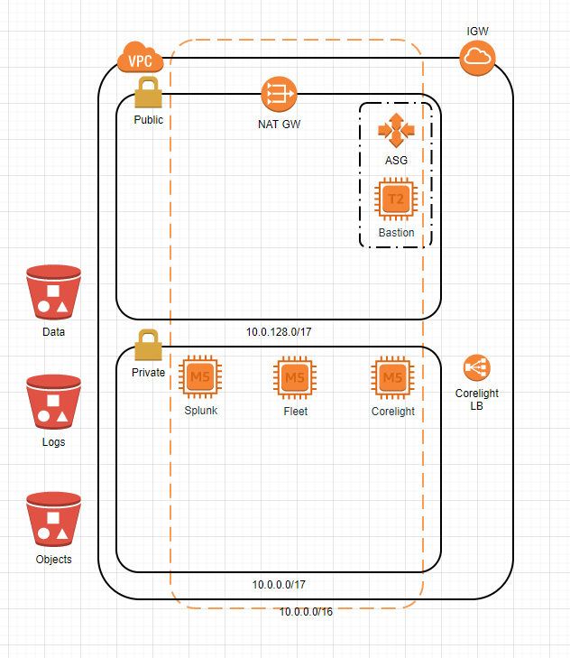

# CorelightAWS

Set of Terraform and Ansible scripts to deploy a simple Corelight lab environment with Splunk as the log search system.  Although Elastic was going to be part of this, it was easier to leave it out as elastic maintains a very well developed set of ansible scripts to deploy elastic in many of the possible configurations one might need.

# Terraform scripts
The terraform scripts are self explanatory; however, a variables file contains much, if not all, of the required configuration items to deploy the architecture.  Basically a single AZ architecture with both Private and Public Subnets.

The variables file can be renamed to variables.tf and is already in the .gitignore file so that keys are not accidentally shared.

The associated VPC Mirroring functionality is deployed with the Corelight Sensor; however there are no instances deployed that are using an interface with the Mirror thus, one must deploy the systems to be monitored and place them in the Public subnet.

S3 Buckets names are there really to track the name.  I ussually use a guid for bucket names so I don't have to worry about collisions; however, I need to note what bucket is for what purpose.  All this should probably be in ansible, including the creation of the bucket and scripts to configure corelight to send log data to the s3 log bucket, file objects to the objects bucket, and keep persistent data/configuration files in the data bucket.

# Ansible scripts
Ansible has some configuration quirks when working with AWS.  Since it is using SSH for everything and our resources are in a Private subnet, a group_vars variable needs to be setup to tell ansible to proxy through the bastion host.  Additionally, a custom ssh.cfg file needs to be created to make it easier to manually log in or tunnel throuh the bastions after ansible is done!  I wrote a script to create both files; however, one needs to provide the correct information for the bastion on the command line to the script.  The script will produce the help document if needed.

Since we are using the Private subnet, our ansible.cfg file also needs to use Private IP addresses so that change has been made already.  I am leaving ec2.ini and ec2.py in this repo for convenience, but one may need to check with ansible to see if they are the most recent versions.

Finally, only two roles are deployed Splunk and Fleet.  All the rest of the configuration shall be done manually.

# YMMV
:-)
